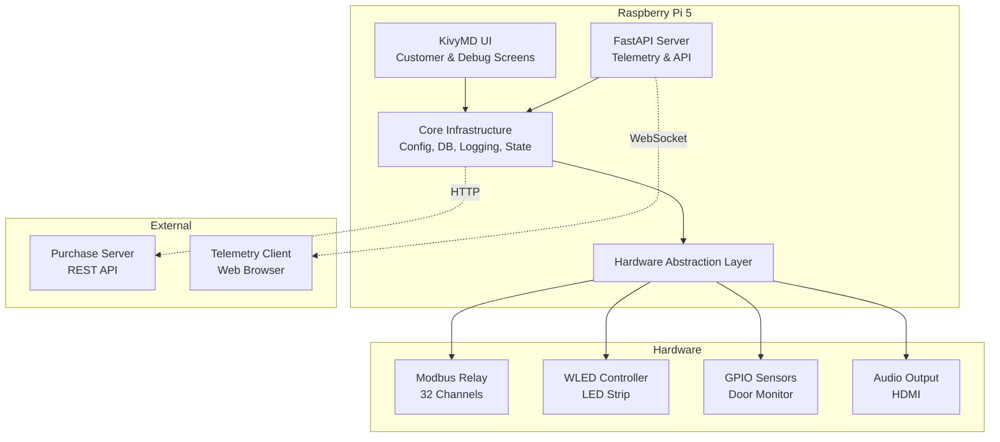
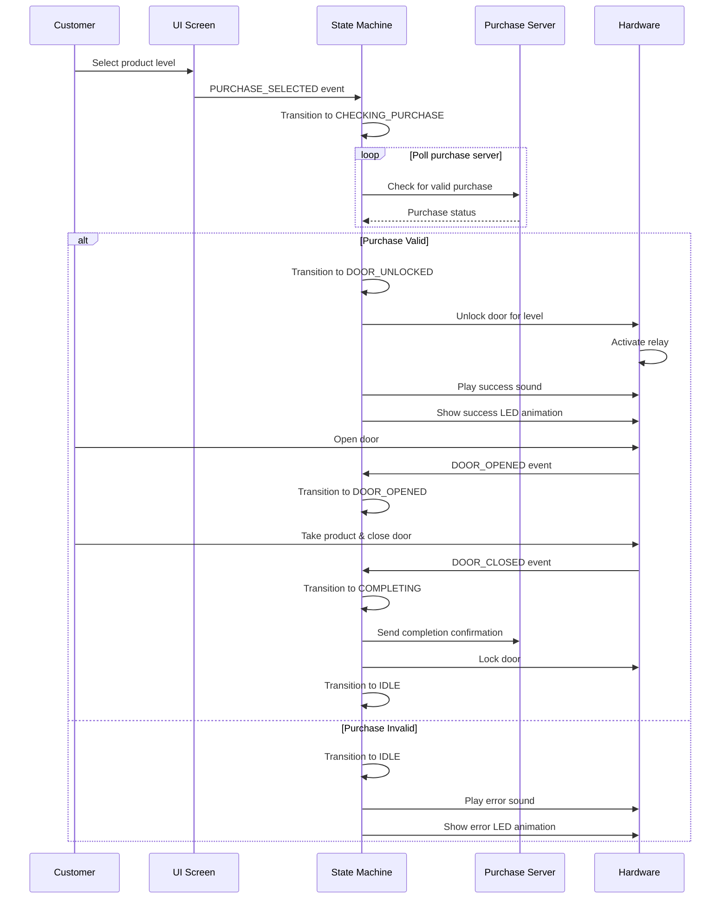
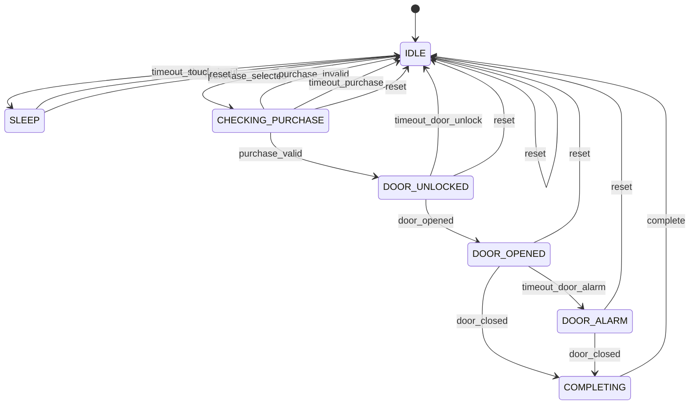

# MoniToni Vending Machine System - System Documentation

Technical architecture and design documentation.

## Table of Contents

- [System Overview](#system-overview)
- [Architecture](#architecture)
- [Core Components](#core-components)
- [Hardware Integration](#hardware-integration)
- [Purchase Flow](#purchase-flow)
- [State Machine](#state-machine)
- [Database Schema](#database-schema)

---

## System Overview

MoniToni is a production-ready vending machine control system designed for reliability, modularity, and ease of maintenance. The system runs on Raspberry Pi 5 and controls all hardware aspects of the vending machine while providing remote monitoring and management capabilities.

### Key Features

- **Hardware Control**: Modbus RTU relays, WLED LED strips, GPIO sensors, audio output
- **User Interface**: KivyMD touchscreen interface for customers and operators
- **Telemetry**: FastAPI-based monitoring and remote control
- **Reliability**: Watchdog timer, comprehensive logging, automatic recovery
- **Testability**: Complete mock hardware implementations for development

---

## Architecture



### Component Layers

1. **Core Infrastructure**: Configuration, database, logging, state management
2. **Hardware Abstraction Layer**: Unified interface for all hardware with mock support
3. **User Interface**: KivyMD-based touchscreen application
4. **Telemetry Server**: FastAPI REST API and WebSocket server
5. **Hardware Drivers**: Modbus, ArtNet, GPIO, Audio implementations

---

## Core Components

### Configuration Management (`monitoni/core/config.py`)

- **YAML-based configuration** with environment-specific overrides
- **Default configuration** (`config/default.yaml`) - version controlled
- **Local overrides** (`config/local.yaml`) - machine-specific, gitignored
- **Pydantic validation** ensures type safety and required fields
- **Deep merge** allows partial overrides

### Database Manager (`monitoni/core/database.py`)

- **SQLite database** for local data storage
- **Async operations** prevent UI blocking
- **Two main tables**:
  - `logs`: Event and error logging with purchase tracking
  - `statistics`: System metrics (purchases, failures, incidents)
- **Automatic schema creation** and migrations
- **Export functionality** for log analysis

### Logging System (`monitoni/core/logger.py`)

- **Dual output**: Console and database
- **Structured logging** with purchase ID tracking
- **Log rotation** for file-based logs
- **Async database writes** via custom handler
- **Integration** with Python's standard logging module

### State Machine (`monitoni/core/state_machine.py`)

Manages purchase flow lifecycle:

**States**:
- `IDLE`: Waiting for user interaction
- `SLEEP`: Low power mode
- `CHECKING_PURCHASE`: Validating with server
- `DOOR_UNLOCKED`: Waiting for customer
- `DOOR_OPENED`: Door opened, waiting for close
- `DOOR_ALARM`: Door left open too long
- `COMPLETING`: Sending completion to server

**Events**:
- User interactions (touch, purchase selection)
- Purchase server responses (valid/invalid)
- Hardware events (door open/close)
- Timeouts (sleep, purchase, door alarm, unlock)

---

## Hardware Integration

### Hardware Abstraction Layer (`monitoni/hardware/base.py`)

All hardware components implement common interface:

```python
class HardwareComponent(ABC):
    async def connect() -> bool
    async def disconnect() -> None
    async def health_check() -> bool
    def is_connected() -> bool
    def get_status() -> Dict
```

### Modbus Relay Controller (`monitoni/hardware/modbus_relay.py`)

- **Protocol**: Modbus RTU over RS485
- **Channels**: 32 relay channels
- **Operations**: Individual channel control, bulk operations
- **Motor control**: Timed activation with configurable delay
- **Door locks**: Per-level lock control (10 levels)

### WLED LED Controller (`monitoni/hardware/wled_controller.py`)

- **Protocol**: ArtNet (DMX over Ethernet)
- **Pixel control**: 300 addressable LEDs
- **Zone mapping**: 10 zones for product levels
- **Animations**: Rainbow chase, breathing, flash, solid colors
- **Brightness control**: Global and per-zone

### GPIO Sensor Controller (`monitoni/hardware/gpio_sensors.py`)

- **Interface**: RPi.GPIO (BCM mode)
- **Door sensor**: Limit switch with configurable pull resistor
- **Event-driven**: Non-blocking callbacks for state changes
- **Debouncing**: 50ms debounce time

### Audio Controller (`monitoni/hardware/audio.py`)

- **Library**: pygame.mixer
- **Output**: HDMI audio
- **Sounds**: Valid purchase, invalid purchase, door alarm
- **Volume control**: 0.0 to 1.0 range

### Hardware Manager (`monitoni/hardware/manager.py`)

- **Centralized access** to all hardware components
- **Automatic fallback** to mock implementations
- **Health monitoring** for all components
- **Convenience methods**: `spin_motor()`, `unlock_door()`, `lock_door()`

---

## Purchase Flow

### Sequence Diagram



### Purchase Flow States

1. **Customer selects product level** (1-10)
2. **System polls purchase server** for authorization
3. **If valid**: Unlock door, play success feedback
4. **Customer opens door** (detected by sensor)
5. **Customer takes product and closes door**
6. **System sends completion** to purchase server
7. **Door locks**, system returns to idle

### Timeout Handling

- **Purchase timeout** (120s default): Cancel if no valid purchase
- **Door unlock timeout** (30s default): Auto-lock if door not opened
- **Door alarm timeout** (10s default): Sound/light alarm if door left open
- **Sleep timeout** (60s default): Enter sleep mode after inactivity

---

## State Machine

### State Transition Diagram



### State Callbacks

The state machine supports callbacks for:
- **State entry**: Called when entering a specific state
- **State transitions**: Called on any state change
- **Timeout events**: Automatically scheduled based on state

---

## Database Schema

### Logs Table

```sql
CREATE TABLE logs (
    id INTEGER PRIMARY KEY AUTOINCREMENT,
    timestamp TEXT NOT NULL,
    purchase_id TEXT,
    level TEXT NOT NULL,
    message TEXT NOT NULL,
    details TEXT,  -- JSON
    created_at DATETIME DEFAULT CURRENT_TIMESTAMP
);

CREATE INDEX idx_logs_timestamp ON logs(timestamp);
CREATE INDEX idx_logs_purchase_id ON logs(purchase_id);
```

**Fields**:
- `id`: Auto-incrementing primary key
- `timestamp`: ISO format timestamp
- `purchase_id`: UUID for purchase tracking (nullable)
- `level`: DEBUG, INFO, WARNING, ERROR, CRITICAL
- `message`: Log message
- `details`: JSON object with additional data
- `created_at`: Database insertion time

### Statistics Table

```sql
CREATE TABLE statistics (
    id INTEGER PRIMARY KEY CHECK (id = 1),
    completed_purchases INTEGER DEFAULT 0,
    failed_purchases INTEGER DEFAULT 0,
    network_incidents INTEGER DEFAULT 0,
    server_incidents INTEGER DEFAULT 0,
    last_updated DATETIME DEFAULT CURRENT_TIMESTAMP
);
```

**Fields**:
- `id`: Always 1 (single row table)
- `completed_purchases`: Successful purchase count
- `failed_purchases`: Failed purchase count
- `network_incidents`: Network connectivity issues
- `server_incidents`: Purchase server unavailable
- `last_updated`: Last update timestamp

---

## Hardware Communication Protocols

### Modbus RTU

- **Physical**: RS485 serial
- **Baud rate**: 9600 (configurable)
- **Data bits**: 8
- **Parity**: None
- **Stop bits**: 1
- **Slave address**: 1 (configurable)
- **Function codes**: Read Coils (0x01), Write Single Coil (0x05), Write Multiple Coils (0x0F)

### ArtNet (WLED)

- **Protocol**: ArtNet (DMX over UDP)
- **Port**: 6454
- **Universe**: 0 (configurable)
- **Packet size**: 900 bytes (300 pixels × 3 bytes RGB)
- **Frame rate**: 30 FPS (configurable)

### GPIO

- **Mode**: BCM (Broadcom pin numbering)
- **Door sensor**: Input with pull-up/down resistor
- **Active state**: Configurable (high or low)
- **Debounce**: 50ms

---

## Error Handling and Recovery

### Hardware Failures

- **Automatic fallback** to mock implementations
- **Health checks** every N seconds
- **Reconnection attempts** with exponential backoff
- **Graceful degradation**: System continues with reduced functionality

### Network Issues

- **Purchase server timeout**: Retry with backoff
- **Network connectivity**: Monitor and log incidents
- **Telemetry server**: Continue operation if external access fails

### System Crashes

- **Watchdog timer**: Automatic reboot if system hangs
- **Systemd restart policy**: Auto-restart on crash
- **Database integrity**: SQLite ACID guarantees
- **Log preservation**: All events logged before crash

---

## Performance Considerations

### Async Operations

- **Non-blocking I/O**: All hardware operations are async
- **Database writes**: Async to prevent UI blocking
- **Network requests**: Async HTTP/WebSocket

### Resource Usage

- **Memory**: ~200MB typical usage
- **CPU**: <10% on Raspberry Pi 5 during normal operation
- **Storage**: Database grows ~1MB per 10,000 logs
- **Network**: Minimal bandwidth (<1 Mbps)

---

## Security

### Access Control

- **Debug mode**: PIN-protected (configurable)
- **Telemetry API**: PIN required for control operations
- **Local network only**: No internet exposure by default

### Data Protection

- **Local storage**: All data stored locally
- **No sensitive data**: Purchase details handled by external server
- **Log rotation**: Automatic cleanup of old logs

---

## Extensibility

### Adding New Hardware

1. Create driver implementing `HardwareComponent` interface
2. Add mock implementation for testing
3. Register in `HardwareManager`
4. Add configuration in `config/default.yaml`

### Adding New States

1. Add state to `State` enum in `state_machine.py`
2. Add events to `Event` enum
3. Implement transition logic in `_get_next_state()`
4. Add timeout handling if needed

### Adding New Animations

1. Define animation in `config/default.yaml`
2. Implement in `WLEDController._run_animation()`
3. Add animation method (e.g., `_rainbow_chase()`)

---

## Monitoring and Diagnostics

### Log Levels

- **DEBUG**: Detailed diagnostic information
- **INFO**: General informational messages
- **WARNING**: Warning messages (non-critical issues)
- **ERROR**: Error messages (recoverable errors)
- **CRITICAL**: Critical errors (system failure)

### Health Checks

- **Hardware components**: Individual health checks
- **Database**: Connection and query tests
- **Network**: Connectivity tests
- **Purchase server**: Availability checks

### Metrics

- **Completed purchases**: Successful transactions
- **Failed purchases**: Failed transactions
- **Network incidents**: Connectivity issues
- **Server incidents**: Purchase server unavailable
- **Uptime**: System uptime tracking

---

## Future Enhancements

### Planned Features

- **Remote firmware updates**: OTA updates via telemetry
- **Advanced analytics**: Purchase patterns, peak times
- **Multi-machine management**: Central dashboard for multiple machines
- **Predictive maintenance**: Hardware failure prediction
- **Energy monitoring**: Power consumption tracking

### Hardware Upgrades

- **LattePanda 3 Delta**: Higher performance option
- **Additional sensors**: Temperature, humidity, vibration
- **Camera integration**: Security and monitoring
- **Payment integration**: Direct payment processing
